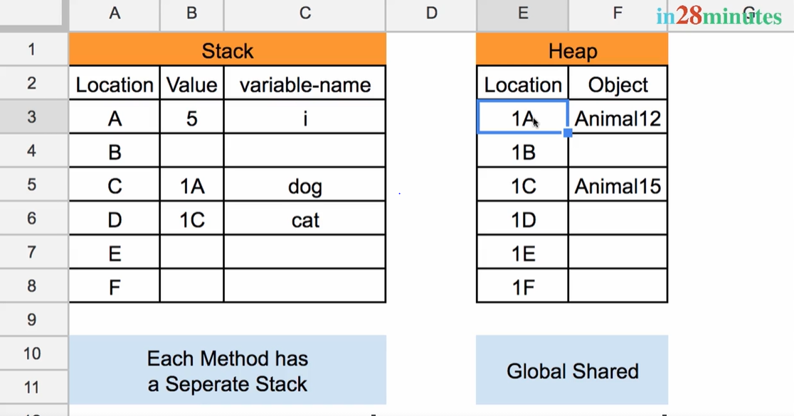

1. Every class is a refrence
2. Object that we create for Class is called reference variable
3. Let's understand how reference variable is different from primitive variable
   1. Whenever Java Program runs there are two types of memory
      1. One is Stack and Another is Heap
   2. When we create new Objects they are stored in Heaps
   3. Reference variables are stored in Heaps whereas primitive variables are stored in Stack
   4. In Stack value which is stored for reference varaible is the location in Heap where reference variable is stored
   5.  Pic Credits : https://courses.in28minutes.com/
   6. If we simply declare a primitive variable and do not initialize it then in stack empty is stored as value for that variable
   7. When we copy value of one reference type variable to another , the value which we assign to variable attributes will also be copied 
   8. 
   9. 